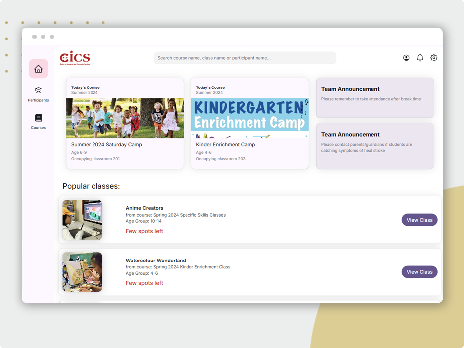
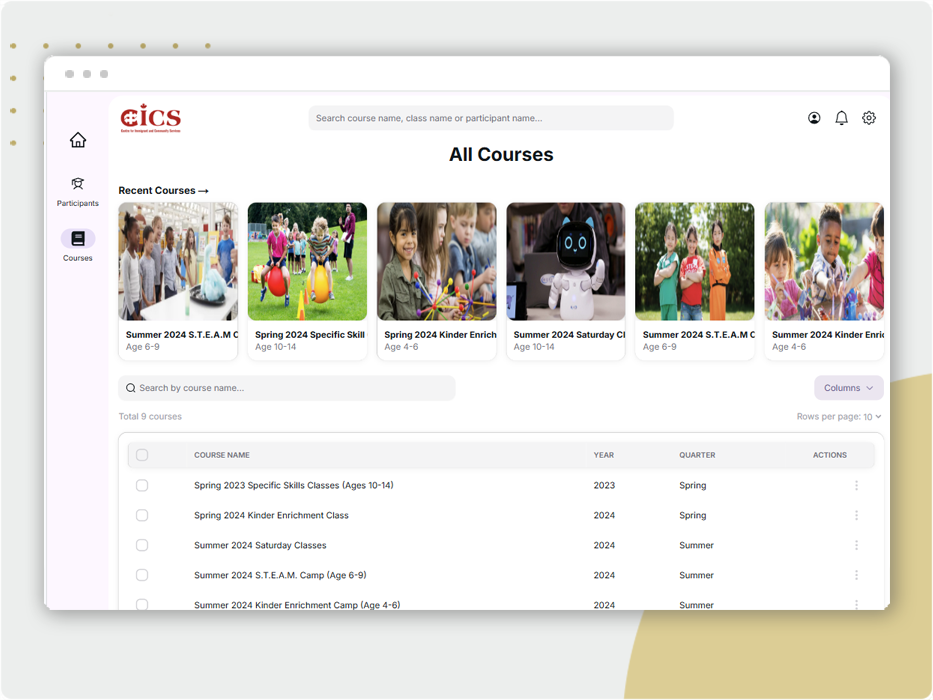
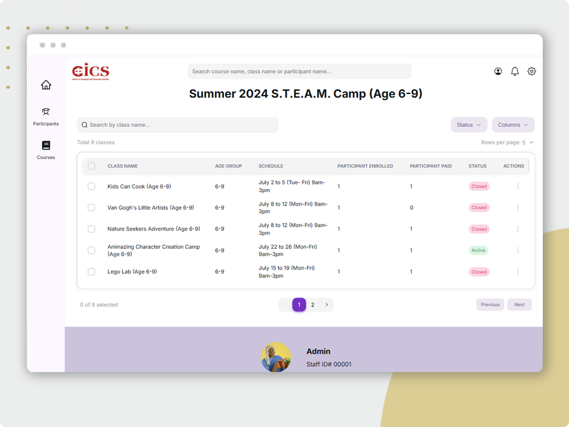
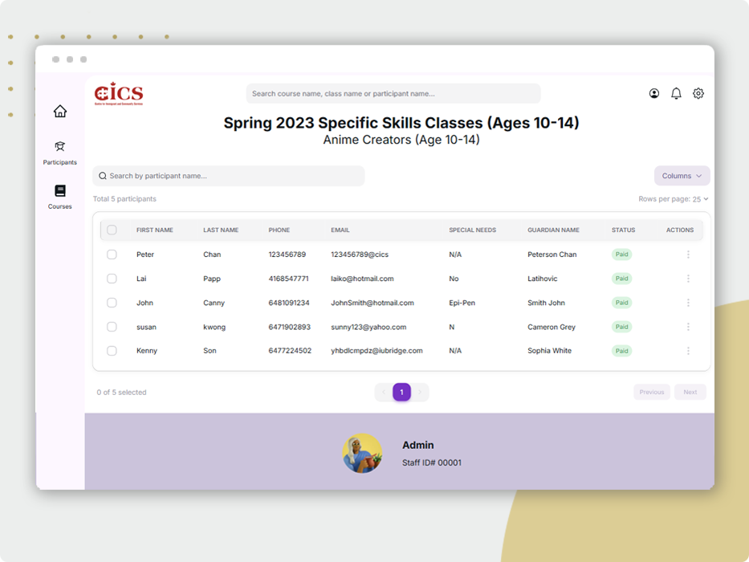
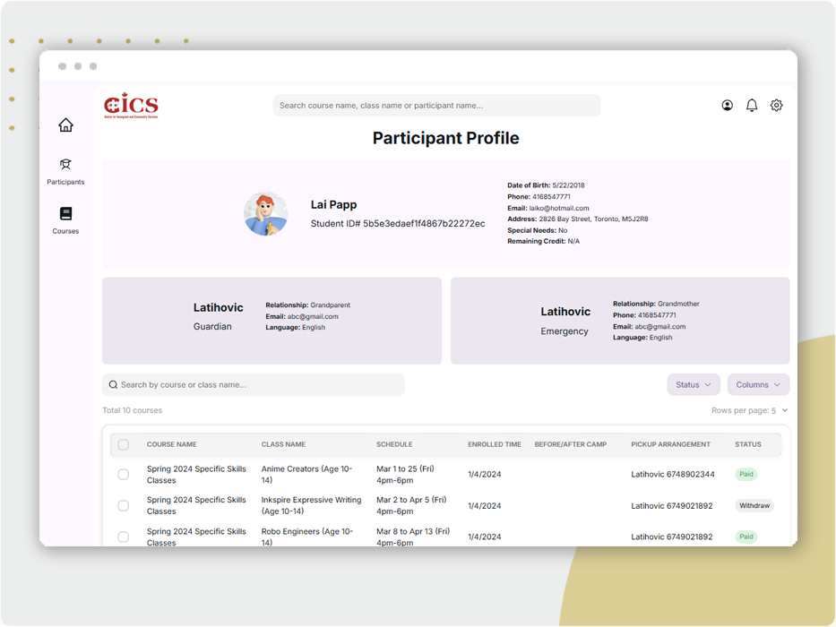

# Learning Centre Dashboard

The Learning Centre Dashboard is a comprehensive, responsive web application designed for educational institutions. It streamlines the management of courses, classes, and participant details while providing an intuitive view of participant enrollment across different classes.



## Live Demo

- Live Site URL: [click here](https://learning-centre-dashboard.vercel.app/)

## Table of Contents

- [Overview](#overview)
- [Features](#features)
- [Technical Details](#technical-details)
- [Screenshots](#screenshots)
- [Installation](#installation)
- [Usage](#usage)
- [Contributing](#contributing)
- [License](#license)
- [Contact](#contact)

## Overview

The Learning Centre Dashboard centralizes key management tasks into one platform. It is designed to help educational institutions:

- **Manage Courses:** Easily create, view, and update course details and schedules.
- **Administer Classes:** Handle class-specific information including instructor details, timing, and resources.
- **Monitor Participants:** Track participant profiles and view enrollment statistics for each class.
- **Mobile Friendly:** Navigate easily through a user-friendly interface optimized for both desktop and mobile devices.

## Features

- **Responsive Navigation:**  
  A sidebar menu provides quick access to the main sections: Dashboard, Classes, and Events.

- **Class Management:**  
  View and update detailed information for each class, including schedules and instructor details.

- **Event Management:**  
  Manage event information such as dates, descriptions, and related details.

- **User-Friendly Interface:**  
  A clean and modern design ensures an intuitive experience without unnecessary clutter.

- **Responsive Navigation:**  
  A sidebar menu allows quick access to all major sections: Dashboard, Courses, Classes, and Participants.

- **Course Management:**  
  Create, update, and view detailed course information such as descriptions, schedules, and resource links.

- **Class Management:**  
  Manage class-specific details, including schedules and instructor assignments.

- **Participant Management:**  
  Maintain participant profiles and monitor which classes they are enrolled in.

- **Enrollment Overview:**  
  Visualize enrollment data to help plan class capacities and allocate resources effectively.

## Technical Details

- **Framework:** Built using **Next.js** and **React**, leveraging server-side rendering for improved performance.
- **Styling:** Uses **Tailwind CSS** for a modern and responsive design.
- **Routing:** Employs Next.js' file-based routing for seamless navigation between pages.
- **State Management:** Utilizes React hooks for efficient state handling and dynamic UI updates.
- **Deployment:** Deployed on **Vercel** to ensure fast, scalable, and reliable performance.

## Screenshots

### Dashboard Overview


### Courses Section



### Class Details & Enrollment

_Classes list page_


_Class enrollment page_


### Participant Information



## Installation

### Prerequisites

- Node.js (v16 or later)
- npm or yarn

### Steps

1. **Clone the Repository:**
   ```bash
   git clone https://github.com/Marjorieccc/Learning-Centre-Dashboard.git
   cd Learning-Centre-Dashboard
   ```

```

```

2. **Install Dependencies:**

```
npm install
# or
yarn install
```

3. **Run the Development Server:**

```
npm run dev
# or
yarn dev
```

4. **Access the Application: Open your browser and navigate to `http://localhost:3000.`**
